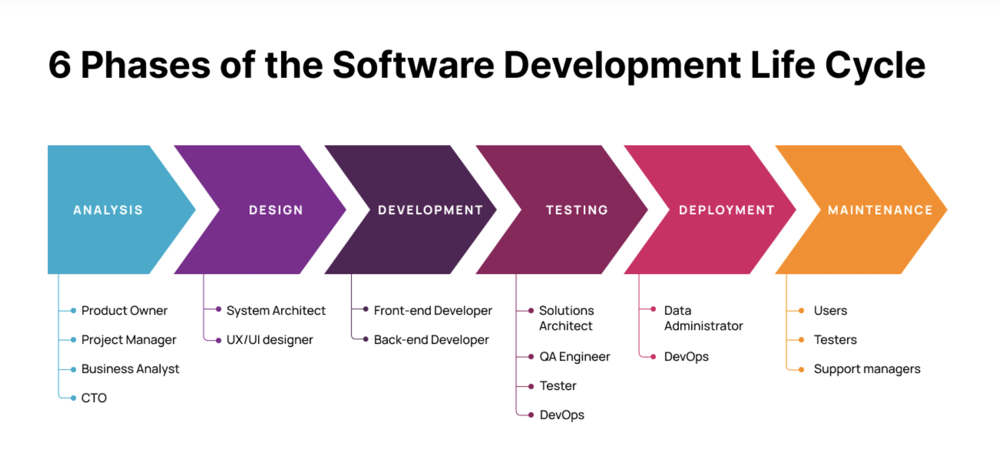
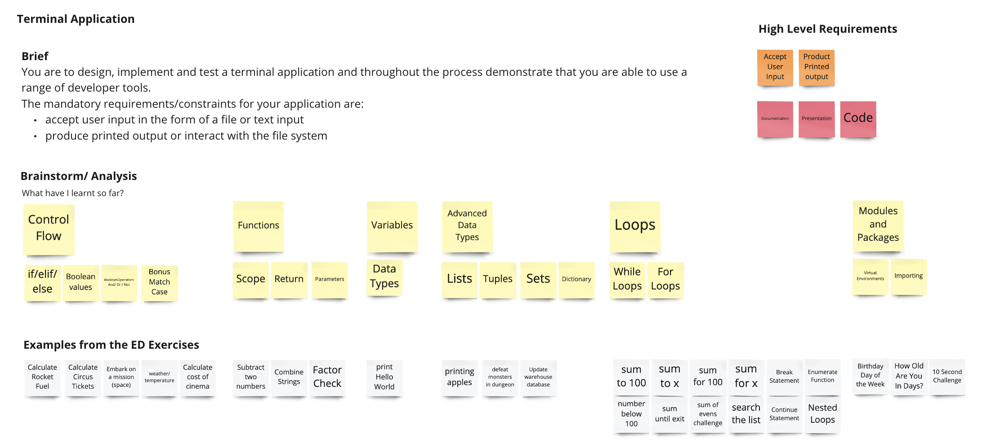
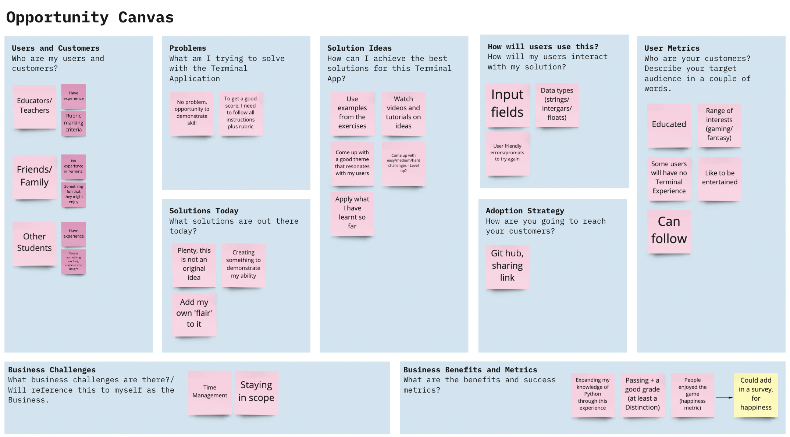
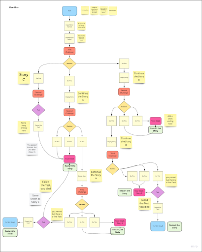
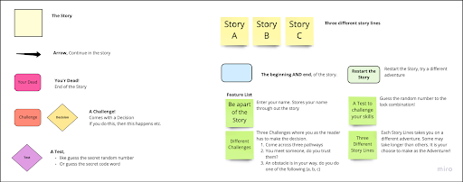
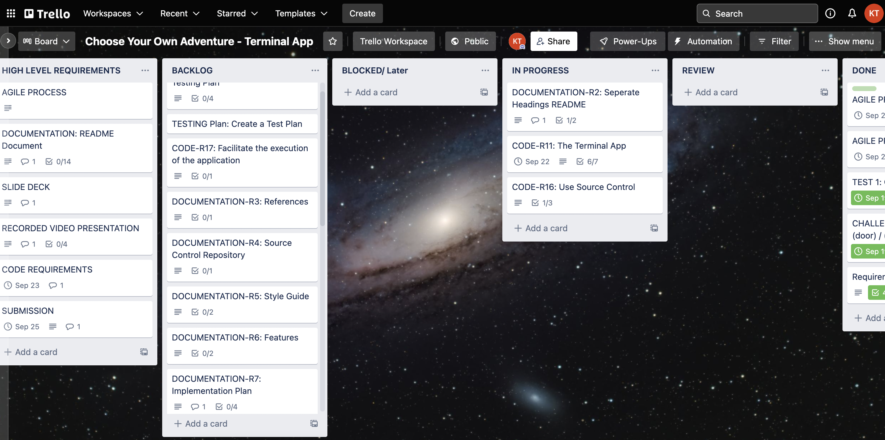
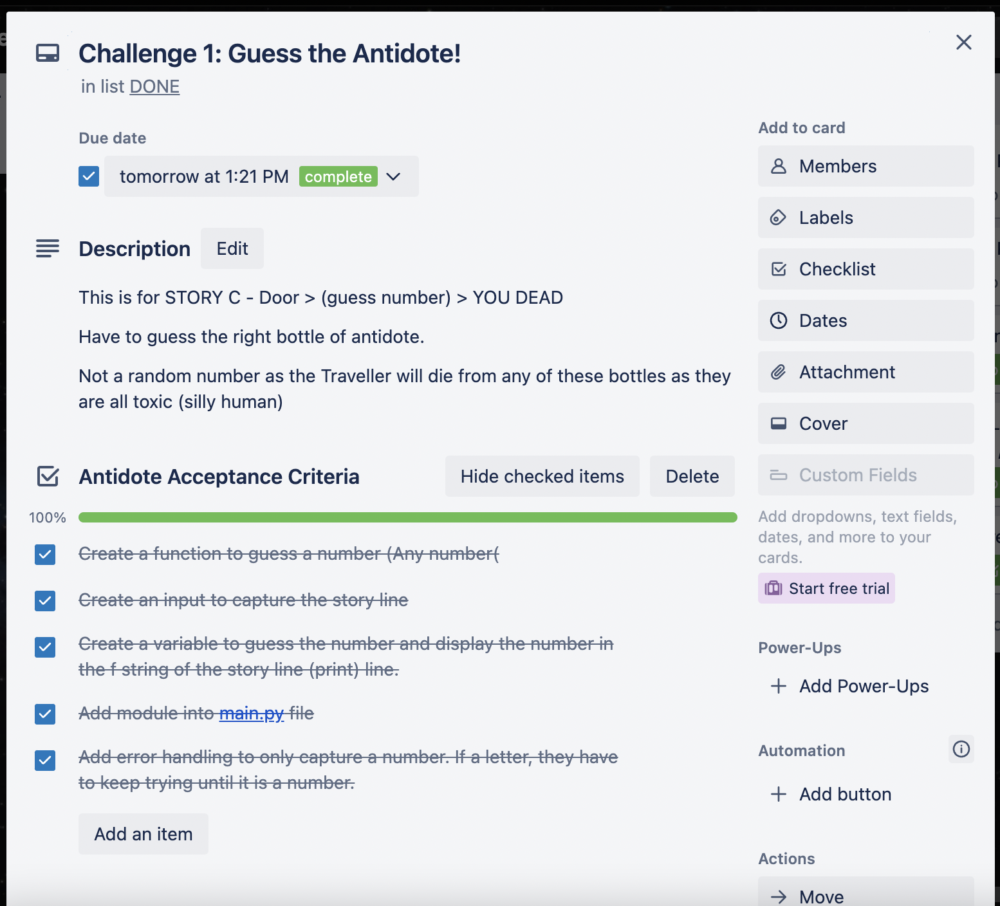
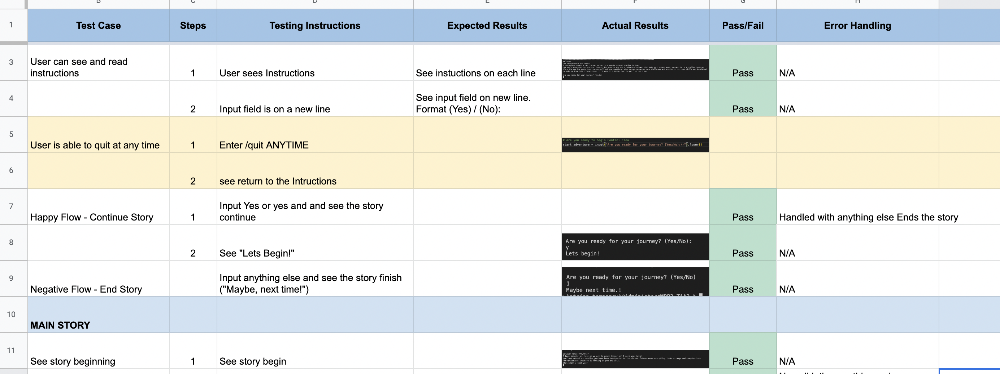
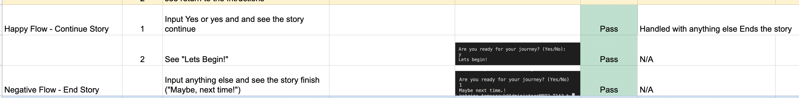

# T1A3 - Terminal Application

Theme: Space Narrative - Choose Your Own Adventure

1. [GitHub Link](https://github.com/KatrinaTom/T1A3_TerminalApp/tree/master)
2. Add in Presentation Link Here

___________________________________________________________________

## Tabel of Contents

- [Brief](#brief)
- [High Level Requirements](#high_level)
- [Introduction](#introduction)

Software Development Plan
1. [Agile Process](#agile)
2. [Analysis](#analysis)
3. [Design](#design)
   * Includes Control Flow Diagram and Key
4. [Features](#features)
5. [Set Up](#setup) 
6. [Development](#development)
7. [Testing](#testing)
8. Deployment
9.  User Interface and Experience
10. Implementation Plan
11. [Install Instructions](#install)

* [Important Links](#links)
* [Reference List](#references)

___________________________________________________________________

## Brief<a title="brief"></a>

You are to design, implement and test a terminal application and throughout the process demonstrate that you are able to use a range of developer tools.

### High Level Requirements<a name="bigh_level"></a>
Requirements for this project are divided into three major parts,
* Documentation
* Presentation
* Code

___________________________________________________________________

## Introduction<a name="introduction"></a>

Welcome Space Traveller! 

This is a choose your own adventure story. A mysterious creature has transported you to a remote outpost station in Space. You don’t recognise the stars or planets, but outside you see a rainbow of colours that take your breath away. You must be in a nursery nebula. 

To help the mysterious creature you will be asked to make decisions and input your responses on your journey. 
Along the way you may encounter some challenges and puzzles to test your skills and knowledge! 


___________________________________________________________________

## Agile Process<a name="agile"></a>
The below is a documentation of the Software Development Cycle for the Terminal Application. Aim of this is to design, implement and test a terminal application. The outcome is to demonstrate that I am able to use a range of developer tools, while also making use of real life software development life cycle processes, such as agile development. 




## Analysis<a name="analysis"></a>
As the product owner, stakeholder, developer and tester for the Terminal Application, the best place to start is the very beginning. The analysis. What do I want to build that will demonstrate my abilities as a developer and use a range of tools to achieve that. 

1. **Identify the requirements**


Through the use of tools such as miro, I can use a virtual whiteboard to help me visualize my ideas and expand on them. 
[Miro White Board Terminal App](https://miro.com/app/board/uXjVPX0yzdY=/)



2.  **Brainstorm an idea that fits the requirements**
   
 Thinking of my skill set as this being my very first attempt as a Terminal Application, I decided on something within my skill range. A choose your own adventure style of application that will strengthen my knowledge of control flow and creating functions.

* Create and display input fields that can make use of various data types 
* Use Control Flow
* Create Variables
* Create Functions 
* Make use of Loops for challenges 
* Expand my experience with importing modules and packages to help in achieving some of these challenges. 

3. **Opportunity Canvas**

I expanded on the basic foundations on what I would like to achieve with my Terminal Application. Even though this isn’t a business strategy, I found it still helpful to focus on what and why I want to achieve and who my end user is. 



**Analysis Results:**
* Easy to read / follow along story
* Easy to understand inputs and enter in details
* Easy/ Medium/ Hard Challenges 
* Entertaining story line 
* Keeping in line with the an Adventure - it will have a series of challenges 

__________________________________________________________________

## Design<a name="design"></a>

Next is to design the Terminal Application now that I understand who my end user is and what I would like this game to achieve. 

* Flowchart 
* Design - PEP 8
* Challenges (What are they and how many) 
* Identifying the Story line - The Theme (It's Space)





## Features<a name="features"></a>

1. Feature 1: Be part of the story

Enter your name and see yourself amongst the story line. The mysterious creature interacting with you along your journey as you help to save the world! 

2. Feature 2: Different Story Lines
   
Every decision you face will determine your outcome. Choose a different path each time to find a new story line. 

3. Feature 3: Test your skills with challenges

In this story you will need your wits and skills, or was that blind luck to solve the puzzles. Keeping the adventure interesting with fun interactive challenges. 

___________________________________________________________________

## Set Up<a name="setup"></a>
Setting up for success requires a little bit of planning. With the help of Trello, I was able to enter in my tasks as Epics and break those out into User Stories/Features. Each Story/Feature has a list of Acceptance Criteria to achieve. 

[Trello - Choose Your Own Adventure](https://trello.com/b/KSBbpWHq/choose-your-own-adventure-terminal-app)



**Columns:**
* High Level Requirements (Epics)
* Backlog (All Tickets to work off)
* Blocked - Sometimes you need a Hard Basket to come back to or are waiting on something before it can be closed. 
* In Progress - A few tickets at the same time, but not taking on too many
* Review - This will come in handy for code, when I go back and refactor
* Done - Best column of all. This is where all the acceptance criteria has been met or definition of done is completed

Example of a Ticket with Acceptance Critieria



___________________________________________________________________

# Development<a name="development"></a>


____________________________________________________________________

# Testing<a name="testing"></a>

Link to Testing Plan:

[Google Documents - Acceptance Testing](https://docs.google.com/spreadsheets/d/11MfBISdv7bes_b3W9-2sHLohp8e025O8-VJ1_nbUH4c/edit#gid=0)



Example of a test (Happy Flow and Negative (sad) Flow)
* This is to handle error handling for positive experience (entering in a string)
* The negative (sad) flow captures when the opposite happens. In this case, an integar or a random character entered. 
* End result is that this case captures and handles the ``else`` statement

! Testing Instructions match the Expected Results, the test is set as PASS.
  



Steps
1. Write up a manual testing plan 
2. Capture all scenarios and error handling (Happy and Sad paths)
3. Where error handling is missing, add error handling
4. Introduce pytest for tests that can be run as a unit test

**Notes**

Overall I found that this to be a manual testing plan with user acceptance tests. Due to the control flow statements, majority of the error handling of data types (strings and integars) are handled by the ``else:`` statement. 

Another learning experience was making sure the user was not trapped in a loop and ensuring a ``break`` statement ``While True:``

The challenges/tests could be tested with Validation Error handling and pytest.

TOTAL User Acceptance Tests = 

_______________________________________________________

# Install Instructions<a name="install"></a>

1. Open Terminal/Command Line Prompt (Mac OS and Windows OS)

**shortcut:** 

On MAC Operating System

command + spacebar (This opens Search)
Type Terminal to open 

2. git clone - Copy, paste the following into Terminal

```git clone git@github.com:KatrinaTom/T1A3_TerminalApp.git```

3. Navigate to the folder on your computer (Folder is called T1A3)

```cd T1A3```

4. Copy, paste the following command into Terminal

```./start.sh```

1. See Welcome message. Have fun on your Space Adenture!


_______________________________________________________

## Important Links<a name="links"></a>

The following important links are tools used to help with Analysis, Discovery and Implementation. Through the use of Trello to track, miro to create flowcharts, user story mapping and Google Docs to help keep a running track of notes.

1. [Trello](https://trello.com/b/KSBbpWHq/choose-your-own-adventure-terminal-app) 
2. [Google Docs - Documentation](https://docs.google.com/document/d/1GACkQYwjTmybJD7bjVqohAr1S3RhtF-iqK6OqnYQ3ZY/edit#)
3. [Miro Board](https://miro.com/app/board/uXjVPX0yzdY=/)

___________________________________________________________________


 ## Reference List<a name="references"></a>
*A list of resources used throughout the Terminal App process*

 * BROCODERS, 2021, [“A Guide to the Agile Software Development Life Cycle (SDLC)](https://brocoders.com/blog/agile-software-development-life-cycle/), accessed 14 Sep 2022.
* Miro, 2022, [Miro](https://miro.com/app/dashboard/) , accessed 14 Sep 2022
* Wikipedia, 2022, [Hugo’s House of Horrors](https://en.wikipedia.org/wiki/Hugo%27s_House_of_Horrors), accessed 14 Sep 2022
* Wikipedia, 2022, [Choose Your Own Adventure](https://en.wikipedia.org/wiki/Choose_Your_Own_Adventure), accessed 14 Sep 2022
* Style The Product, 2020, [Opportunity Assessment Template](https://www.styletheproduct.com/articles/product-discovery/opportunity-assessment-template/), accessed 14 Sep 2022
* Lucidchart, 2022, [What is a Flowchart](https://www.lucidchart.com/pages/what-is-a-flowchart-tutorial#top), accessed 15 Sep 2022
* Python, 2022, [PEP 8 Style Guide for Python Code](https://peps.python.org/pep-0008/), accessed 16 Sep 2022
* NASA, 2022 [Heading Into (Orbital) Sunrise](https://www.nasa.gov/multimedia/imagegallery/iotd.html), accessed 19 Sep 2022
* pypi.org, 2022 [argv 0.0.3](https://pypi.org/project/argv/), accessed 20 Sep 2022
  
