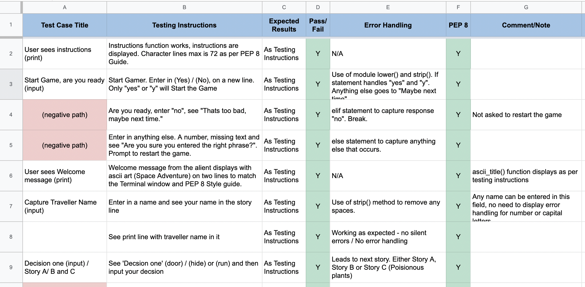
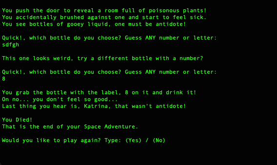
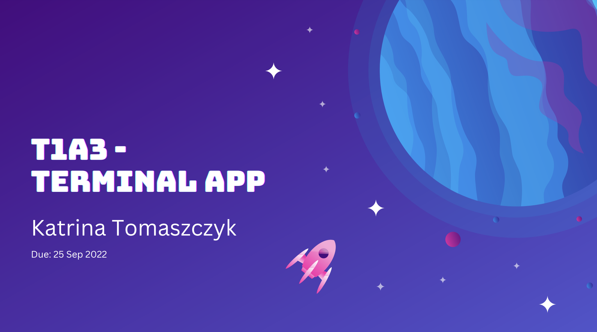

# T1A3 - Terminal Application

Theme: Space Narrative - Choose Your Own Adventure

1. [GitHub Link](https://github.com/KatrinaTom/T1A3_TerminalApp/tree/master)
2. Add in Presentation Link Here (Video)
3. [Powerpoint Presentation Link](docs/images/ppt_title.png)
4. [Recording of Terminal App - Choose Your Own Adventure](https://vimeo.com/752803413/ff96e9476b)

*Music provided by John Serrie, "Pan Galatic"*


___________________________________________________________________

## Tabel of Contents

- [Brief](#brief)
- [High Level Requirements](#high_level)
- [Introduction](#introduction)

Software Development and Implementation Plan
1. [Agile Process](#agile)
2. [Analysis](#analysis)
3. [Design](#design)
   * Includes Control Flow Diagram and Key
4. [Features](#features)
5. [Set Up](#setup) 
6. [Development](#development)
   * Included User Story Mapping
7. [Testing](#testing)
8. [Deployment](#deployment)
9.  [User Interface and Experience](#interface)
10. [Install Instructions](#install)
11. [Powerpoint presentaion](#powerpoint)

* [Important Links](#links)
* [Reference List](#references)

___________________________________________________________________

## Brief<a title="brief"></a>

You are to design, implement and test a terminal application and throughout the process demonstrate that you are able to use a range of developer tools.

### High Level Requirements<a name="bigh_level"></a>
Requirements for this project are divided into three major parts,
* Documentation
* Presentation
* Code

___________________________________________________________________

## Introduction<a name="introduction"></a>

Welcome Space Traveller! 

This is a choose your own adventure story. A mysterious creature has transported you to a remote outpost station in Space. You don’t recognise the stars or planets, but outside you see a rainbow of colours that take your breath away. You must be in a nursery nebula. 

To help the mysterious creature you will be asked to make decisions and input your responses on your journey. 
Along the way you may encounter some challenges and puzzles to test your skills and knowledge! 


___________________________________________________________________

## Agile Process<a name="agile"></a>
The below is a documentation of the Software Development Cycle for the Terminal Application. Aim of this is to design, implement and test a terminal application. The outcome is to demonstrate that I am able to use a range of developer tools, while also making use of real life software development life cycle processes, such as agile development. 


## Analysis<a name="analysis"></a>
As the product owner, stakeholder, developer and tester for the Terminal Application, the best place to start is the very beginning. The analysis. What do I want to build that will demonstrate my abilities as a developer and use a range of tools to achieve that. 

1. **Identify the requirements**


Through the use of tools such as miro, I can use a virtual whiteboard to help me visualize my ideas and expand on them. 
[Miro White Board Terminal App](https://miro.com/app/board/uXjVPX0yzdY=/)


2.  **Brainstorm an idea that fits the requirements**
   
 Thinking of my skill set as this being my very first attempt as a Terminal Application, I decided on something within my skill range. A choose your own adventure style of application that will strengthen my knowledge of control flow and creating functions.

* Create and display input fields that can make use of various data types 
* Use Control Flow
* Create Variables
* Create Functions 
* Make use of control flow for challenges 
* Expand my experience with importing modules and packages to help in achieving some of these challenges. 

3. **Opportunity Canvas**

I expanded on the basic foundations on what I would like to achieve with my Terminal Application. Even though this isn’t a business strategy, I found it still helpful to focus on what and why I want to achieve and who my end user is. 


**Analysis Results:**
* Easy to read / follow along story
* Easy to understand inputs and enter in details
* Easy/ Medium/ Hard Challenges 
* Entertaining story line 
* Keeping in line with the Adventure - it will have a series of challenges 

End User being someone that enjoys a simple game, and can use a computer with ease. 

__________________________________________________________________

## Design<a name="design"></a>

Next is to design the Terminal Application now that I understand who my end user is and what I would like this game to achieve. 

* Flowchart 
* Design - PEP 8
* Challenges (What are they and how many) 
* Identifying the Story line - The Theme (It's Space)


Below is my First Attempt at a Flow Chart before I started Developing. 


FINAL Flowchat - Version 3


**Note**

Using agile methology, the development process included continual testing and enhancement of features. Including updating the story line decisions to capture the best outcome for the end user. Only a slight change to the flow chart.

This included adding additional notes to the flow chart for reference.

__________________________________________________________________________________


## Features<a name="features"></a>

1. Feature 1: Be part of the story, see your name. 

Enter your name and see yourself amongst the story line. The mysterious creature interacting with you along your journey as you help to save the world! 


2. Feature 2: Different Story Lines (Story A, Story B and Story C).
   
Every decision you face will determine your outcome. Choose a different path each time to find a new story line. 


1. Feature 3: Test your skills with challenges

Each story you will need your wits and skills, or was that blind luck to solve the puzzles. Keeping the adventure interesting with fun interactive challenges. 


___________________________________________________________________

## Set Up<a name="setup"></a>
Setting up for success requires a little bit of planning. With the help of Trello, I was able to enter in my tasks as Epics and break those out into User Stories/Features. Each Story/Feature has a list of Acceptance Criteria to achieve. 

[Trello - Choose Your Own Adventure](https://trello.com/b/KSBbpWHq/choose-your-own-adventure-terminal-app)


**Columns:**
* High Level Requirements (Epics)
* Backlog (All Tickets to work off)
* Blocked - Sometimes you need a Hard Basket to come back to or are waiting on something before it can be closed. (I also didn't use this at all. I either left it in the backlog or tackled it as my first task of the day)
* In Progress - A few tickets at the same time, but not taking on too many
* Review - This will come in handy for code, when I go back and refactor (I found that I didn't use this column, the ticket stayed in progress till I could review/refactor the code.)
* Done - Best column of all. This is where all the acceptance criteria has been met or definition of done is completed


Below image of "In Progress" of Trello Board


**Checklist Code Requirements** 
- (Y) R11 - Implement Features (variables, conditional control structures, functions, simple error handling, input and output, importing Python packages, using Python packages)
- (Y) R12 - DRY (Applied where I could find repeating code. Turned them into functions). Excellent way to keep everything neat/ tidy and easier to update. 
- (Y) R13 - Apply all styles and conventions. (I applied PEP 8 Style Guide as much as I could. Reviewing print lines to only have 72 Characers. Followed indendation. This is a skill I would need to practice)
- (Y) R14 - Create an application which runs without error and consistent with development plan. (The Story line works, the feastures and challenges work as per the original plan. Alot of manual testing was involved to get the functionality correct, refactor and then design wise improve the experience for the user.)
- (Y) R15 - Design Two tests which check that the application is running as expected. (This is outlined in the Testing Plan. These tests where manual as majority of the error handling consistent of if/elif/else statements to catch the negative paths)
- (Y) R16 - Utlise source control. (SAVE, SAVE, SAVE! This also came in handy when refactoring and referencing back what I changed so I could fix it.)
- (Y) R17 - Utlise developer tools to faciliate the execution of the application (Bash script, as basic as it is, this was used to help the end user run the application.)

## Acceptance Criteria 
Example of a Ticket with Acceptance Critieria


Example of a Ticket with Acceptance Criteria for manual End to End Testing of a Positive (Happy Path) for Story C. 


___________________________________________________________________

# Development<a name="development"></a>

Through the use of miro (a virtual whiteboard), I used a Story Mapping technique to breakout my features and development plan. 

[Miro - Story Mapping](https://miro.com/app/board/uXjVPX0yzdY=/)


Reading from left to right, I started with the main tasks I needed to accomplish.

## Development Plan

1. Create High Level Tickets (yellow tickets), that would translate to the Skeleton of my main.py file. 

2. Idenfy the user story (the white tickets)
Order of User Storys (I didn't write these as user story, more as tasks)
* Title
* Instructions
* Feature 1 - input Traveller Name and Display in Story 
* Feature 2 - Create three different story lines 
* Story A + if/else statements (Happy and Sad flows)
* Story B + if/else statements (Happy and Sad flows)
* Story C + if/else statements (Happy and Sad flows)
* Feature 3 - Create Challenges with functions 
* Story A Challenge (Choose the right container of food)
* Story B Challenge (Guessing Game of Metal Box)
* Story C Challenge (Pick the right container of antidote)
* Error Validation in Challenges
* Create functions to restart the game

3. Apply DRY (Don't Repeat Yourself)
Find repeating code and create these into functions. 

4. Create a restart the game functionality 

5. Refactor the code to be inline with PEP 8 Style guide. 
* Review all lines of code to match the length
* Review naming conventions, do they make sense and can anyone understand them
* Review Code, can I improve on it without breaking it. 

6. Iterative Testing
* Each feature and User Story was tested progressively
* Saving/Deployment to Git regularly to save update and to help with testing (In case I broke something)
  
7. End to End Testing
* This required the manual testing plan. Test all scenarios (Happy/ Sad paths)
* input fields can handle strings and integars
* If failing, add in error Validation
* Test on different devices/ operating systems

8. Software Development Tools
* Create a bash script to run the program
* Create a virtual environment to import Python packages

____________________________________________________________________

# Testing<a name="testing"></a>

Link to Testing Plan:

[Google Documents - Acceptance Testing](https://docs.google.com/spreadsheets/d/11MfBISdv7bes_b3W9-2sHLohp8e025O8-VJ1_nbUH4c/edit#gid=0)

First attempt at writiing End to End User Testing. 

Each test included screenshots. Testing was done through the process of developement. The thought process was to develop with a test in mind. A User Acceptance criteria that could be tested. 


Example of a test (Happy Flow and Negative (sad) Flow)
* This is to handle error handling for positive experience (entering in a string)
* The negative (sad) flow captures when the opposite happens. In this case, an integar or a random character entered. 
* End result is that this case captures and handles the ``else`` statement

! Testing Instructions match the Expected Results, the test is set as PASS.
  


**Steps**
1. Write up a manual testing plan 
2. Capture all scenarios and error handling (Happy and Sad paths)
3. Where error handling is missing, add error handling
4. Introduce pytest for tests that can be run as a unit test


### End to End Testing 

My Terminal App is completed. Time to test each feature and overall application. 

See Google Sheet / Tab - "AT - 22 SEP 22"
[Google Sheet - Acceptance Tests](https://docs.google.com/spreadsheets/d/11MfBISdv7bes_b3W9-2sHLohp8e025O8-VJ1_nbUH4c/edit#gid=648163021)

High Level Testing

1. Test Feature 1 (Traveller Name): PASS
   * User can input "traveller_name". Can be in the from of a string or integars (You may be also be a space alien with a strange name). This field will take ANY input. 
   * Display "traveller_name" throughout the story. 
   * Negative Test: Does not handle spaces. If the user does not enter in anything, nothing will display. 
2. Test Feature 2 (Different Stories): PASS
   * Tested the different stories, A, B, C and decisions. 
   * Input captures capitals letters and lowered this.
   * Input captured integars and control flow handled this with else statement.
   * Negative Tests: Each decision inclused else block to capture rougue inputs. Resulted in the end of the game. 
3. Test Feature 3 (Challenges): PASS
   * Test each Challenge and error handling captures input field if/else statements.
   * Capture valueError
   * Capture range error
  


### Further Testing Plan - End to End Testing




**Notes**

Overall I found that this to be a manual testing plan with user acceptance tests. Due to the control flow statements, majority of the error handling of data types (strings and integars) are handled by the ``else:`` statement. 

Another learning experience was making sure the user was not trapped in a loop and ensuring a ``break`` statement ``While True:``

The challenges have additional error handling to capture valueError. 


# Deployment<a name="deployment"></a>

Deployment to GitHub [GitHub](https://github.com/KatrinaTom/T1A3_TerminalApp)

Source Folder
-README.md

/docs
- images (as seen in this README.md)
- images/game_images

/ppt
- Access to the Powerpoint presentation
  
/src
- .gitignore 
- ascii.py
- endings.py
- functions.py
- main.py
- start.sh
- story_line.py

_______________________________________________________

# Install Instructions<a name="install"></a>

1. Open Terminal/Command Line Prompt (Mac OS and Windows OS)

**shortcut:** 

On MAC Operating System

command + spacebar (This opens Search)
Type Terminal to open 

2. git clone - Copy, paste the following into Terminal

```git clone git@github.com:KatrinaTom/T1A3_TerminalApp.git```

3. Navigate to the folder on your computer (Folder is called T1A3)

```cd T1A3```

4. Make sure you are in the folder src

```cd src```

4. Copy, paste the following command into Terminal

```./start.sh```

1. See Welcome message. Have fun on your Space Adenture!


**Helpful Hints**

Make sure you have the latest Python packages installed. 

You will need python3 to run this. For the lastest documentation please follow the Python.org link.

[Python.org](https://www.python.org/downloads/)

__________________________________________________________________________________


# User Interface and Experience<a name="interface"></a>

Below are images from the game. To experience the Space Adventure for yourself, 
enter in your answers and follow the story line. 

Instructions for the game


Welcome message from the alien


Story A - You choose to run! With the Ending 


Story B - Guess the right password


Story C - A room full of poisionous plants


Story C - Ending



__________________________________________________________________________________

# Powerpoint Presentation<a name="powerpoint"></a>

Please find the link to the entire Powerpoint presentation below:

[Powerpoint Presentation](ppt/T1A3_KatrinaTomaszczyk.pdf)


_______________________________________________________

## Important Links<a name="links"></a>

The following important links are tools used to help with Analysis, Discovery and Implementation. Through the use of Trello to track, miro to create flowcharts, user story mapping and Google Docs to help keep a running track of notes.

1. [Trello](https://trello.com/b/KSBbpWHq/choose-your-own-adventure-terminal-app) 
2. [Google Docs - Documentation](https://docs.google.com/document/d/1GACkQYwjTmybJD7bjVqohAr1S3RhtF-iqK6OqnYQ3ZY/edit#)
3. [Miro Board](https://miro.com/app/board/uXjVPX0yzdY=/)

___________________________________________________________________


 ## Reference List<a name="references"></a>
*A list of resources used throughout the Terminal App process*

 * BROCODERS, 2021, [“A Guide to the Agile Software Development Life Cycle (SDLC)](https://brocoders.com/blog/agile-software-development-life-cycle/), accessed 14 Sep 2022.
* Miro, 2022, [Miro](https://miro.com/app/dashboard/) , accessed 14 Sep 2022
* Wikipedia, 2022, [Hugo’s House of Horrors](https://en.wikipedia.org/wiki/Hugo%27s_House_of_Horrors), accessed 14 Sep 2022
* Wikipedia, 2022, [Choose Your Own Adventure](https://en.wikipedia.org/wiki/Choose_Your_Own_Adventure), accessed 14 Sep 2022
* Style The Product, 2020, [Opportunity Assessment Template](https://www.styletheproduct.com/articles/product-discovery/opportunity-assessment-template/), accessed 14 Sep 2022
* Lucidchart, 2022, [What is a Flowchart](https://www.lucidchart.com/pages/what-is-a-flowchart-tutorial#top), accessed 15 Sep 2022
* Python, 2022, [PEP 8 Style Guide for Python Code](https://peps.python.org/pep-0008/), accessed 16 Sep 2022
* NASA, 2022 [Heading Into (Orbital) Sunrise](https://www.nasa.gov/multimedia/imagegallery/iotd.html), accessed 19 Sep 2022
* pypi.org, 2022, [argv 0.0.3](https://pypi.org/project/argv/), accessed 20 Sep 2022
* python,org, 2022, [python.org](https://www.python.org/downloads/), accessed 23 Sep 2022
* John Serrie, 2002, [Pan Galatic](https://open.spotify.com/track/4dypSibFbWPQVTDSDFlwXQ), accessed 23 Sep 2022. 
  
