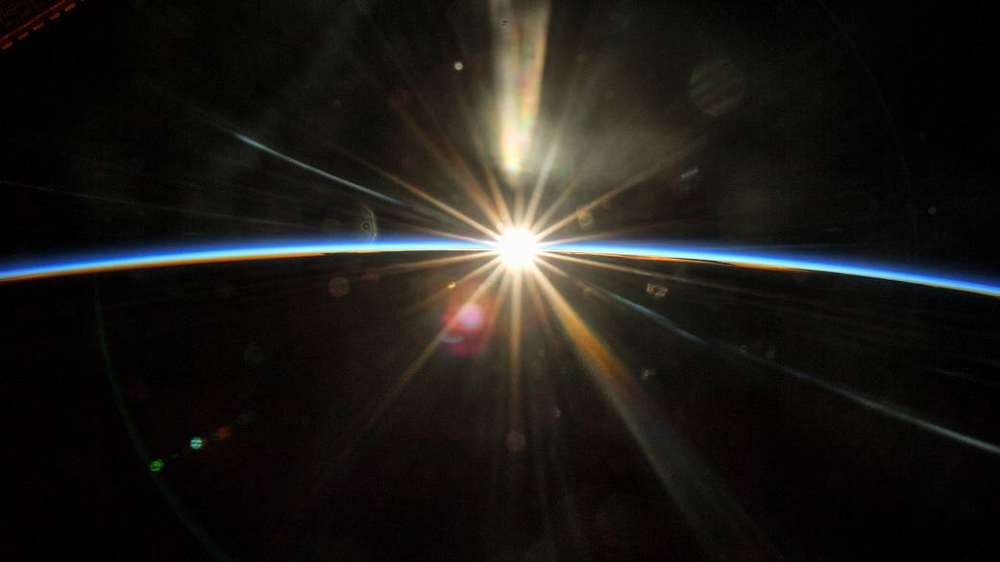

# T1A3 - Terminal Application

Theme: Space Narrative - Choose Your Own Adventure

1. [GitHub Link](https://github.com/KatrinaTom/T1A3_TerminalApp/tree/master)
2. Add in Presentation Link Here

___________________________________________________________________

## Tabel of Contents

- [Brief](#brief)
- [High Level Requirements](#high_level)
- [Introduction](#introduction)

1. [Agile Process](#agile)
    1. [Analysis](#analysis)
    2. [Design](#design)
    3. Development
    4. Testing
    5. Deployment
2. Software Development Plan
3. Features 
4. Control Flow Diagram
5. User Interface and Experience
6. Implementation Plan
7. Testing
8. Install Instructions

* [Important Links](#links)
* [Reference List](#references)

___________________________________________________________________

## Brief

You are to design, implement and test a terminal application and throughout the process demonstrate that you are able to use a range of developer tools.

### High Level Requirements
Requirements for this project are divided into three major parts,
* Documentation
* Presentation
* Code

___________________________________________________________________

## Introduction

Welcome Space Traveller! 
This is a choose your own adventure story. A mysterious creature has transported you to a remote outpost station in Space. You don’t recognise the stars or planets, but outside you see a rainbow of colours that take your breath away, you must be in a nursery nebula. 

To help the mysterious creature you will be asked to make decisions and input your responses on your journey. 
Along the way you may encounter some challenges and puzzles to test your skills and knowledge! 

___________________________________________________________________

## Agile Process
The below is a documentation of the Software Development Cycle for the Terminal Application. Aim of this is to design, implement and test a terminal application. The outcome is to demonstrate that I am able to use a range of developer tools, while also making use of real life software development life cycle processes, such as agile development. 

## Analysis

### Design

___________________________________________________________________

## Important Links

The following important links are tools used to help with Analysis, Discovery and Implementation. Through the use of Trello to track, miro to create flowcharts, user story mapping and Google Docs to help keep a running track of notes.

1. [Trello](https://trello.com/b/KSBbpWHq/choose-your-own-adventure-terminal-app) 
2. [Google Docs - Documentation](https://docs.google.com/document/d/1GACkQYwjTmybJD7bjVqohAr1S3RhtF-iqK6OqnYQ3ZY/edit#)
3. [Miro Board](https://miro.com/app/board/uXjVPX0yzdY=/)

___________________________________________________________________

 ## Reference List
*A list of resources used throughout the Terminal App process*

 * BROCODERS, 2021, [“A Guide to the Agile Software Development Life Cycle (SDLC)](https://brocoders.com/blog/agile-software-development-life-cycle/), accessed 14 Sep 2022.
* Miro, 2022, [Miro](https://miro.com/app/dashboard/) , accessed 14 Sep 2022
* Wikipedia, 2022, [Hugo’s House of Horrors](https://en.wikipedia.org/wiki/Hugo%27s_House_of_Horrors), accessed 14 Sep 2022
* Wikipedia, 2022, [Choose Your Own Adventure](https://en.wikipedia.org/wiki/Choose_Your_Own_Adventure), accessed 14 Sep 2022
* Style The Product, 2020, [Opportunity Assessment Template](https://www.styletheproduct.com/articles/product-discovery/opportunity-assessment-template/), accessed 14 Sep 2022
* Lucidchart, 2022, [What is a Flowchart](https://www.lucidchart.com/pages/what-is-a-flowchart-tutorial#top), accessed 15 Sep 2022
* Python, 2022, [PEP 8 Style Guide for Python Code](https://peps.python.org/pep-0008/), accessed 16 Sep 2022
* NASA, 2022 [Heading Into (Orbital) Sunrise](https://www.nasa.gov/multimedia/imagegallery/iotd.html), accessed 19 Sep 2022
* 
